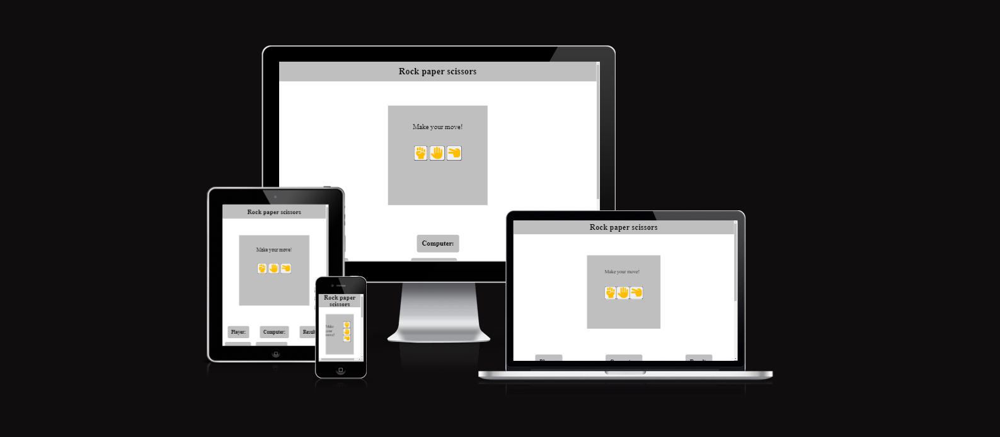
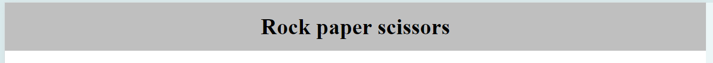
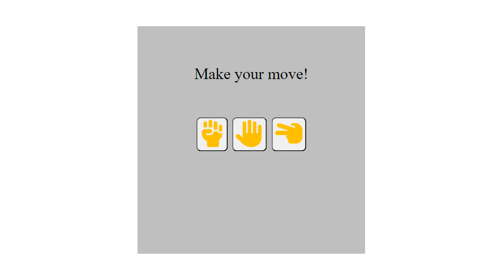
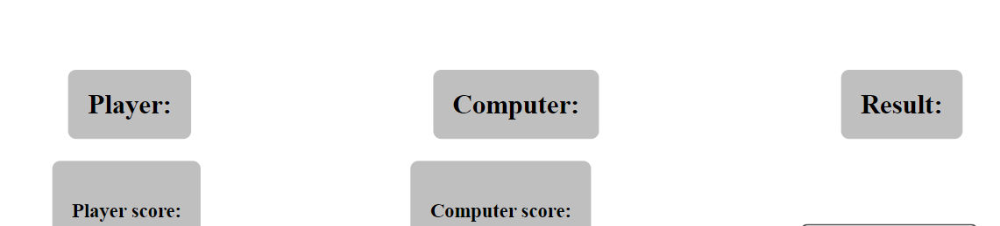
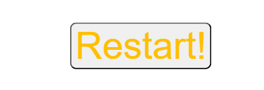

# Rock Paper Scissors

Rock Paper Scissors is a fun easy to learn game anyone can play, it caters to all ages and is fun to do. The bottom of the site has a helpful link for people who are new to the game but I'm sure that most people will have played it gorwing up. 

The javascript is simple and easy to understand with no complications. The game has 3 buttons: Rock, paper and scissors, the user will choose one of these and the computer will pick at random, the results will display in boxes below the buttons and the scores are counted for the user and computer. Also there is a helpful reset button that refreshes the scores if the user wants to start again at 0. 

### Existing Features

- __Header__

  - Featured at the top of the page, the heading is easy to read. Upon viewing the page, the user will be able to see the name of the game.

- __Game area__

  - This section will allow the user to play rock, paper, scissors. The user will be able to easily see the buttons rock, paper and scissors.
  - The user will be able to select the button they want. 

- __The Score Area__

  - This section will allow the user to see exactly how many correct and incorrect answers they have provided.
  - It will also show when the player wins, draws or ties. 

-__Restart button__

-This button allows the player to restart the game therefore resetting the score for them and the computer.

-__Footer__

-A link in the footer is provided to allow the user to go to the official rock paper scissors rules website.

## Testing 

-__Fixing bugs__

-Overall my html and css had a few very minor bugs that required a few tweaks to run through the validator.
-The only bugs my javascript had was missing semi-colons and those were very simple to fix.

-__Responsiveness__

-I used a media query for screen sizes 480px and smaller rather than using multiple larger ones. I had one problem where I couldn't make the rock, paper, scissors box larger on smaller screens, it had turned out I had added a 120px margin so that was soon fixed.
-Also I used developer tools for flexbox and it made it much easier to get everything responsive on screen sizes 480px and above.

### Validator Testing 

- HTML
    - No errors were returned when passing through the official [W3C validator](https://validator.w3.org/nu/?doc=https%3A%2F%2Fcode-institute-org.github.io%2Flove-maths%2F)
- CSS
    - No errors were found when passing through the official [(Jigsaw) validator](https://jigsaw.w3.org/css-validator/validator?uri=https%3A%2F%2Fvalidator.w3.org%2Fnu%2F%3Fdoc%3Dhttps%253A%252F%252Fcode-institute-org.github.io%252Flove-maths%252F&profile=css3svg&usermedium=all&warning=1&vextwarning=&lang=en)
- JavaScript
    - No errors were found when passing through the official [Jshint validator](https://jshint.com/)
      - The following metrics were returned: 
      - There are 5 functions in this file.
      - Function with the largest signature takes 2 arguments, while the median is 1.
      - Largest function has 11 statements in it, while the median is 1.
      - The most complex function has a cyclomatic complexity value of 10 while the median is 1.

### Unfixed Bugs

As far as I know I don't have any unfixed bugs, however I should have started with mobile phone sizes instead of working my way backwards.

## Deployment

- The site was deployed to GitHub pages. The steps to deploy are as follows: 
  - In the GitHub repository, navigate to the Settings tab 
  - From the source section drop-down menu, select the Master Branch
  - Once the master branch has been selected, the page will be automatically refreshed with a detailed ribbon display to indicate the successful deployment. 

The live link can be found here - https://zakl1.github.io/project2javascript/

## Credits 

- I'd like to credit my mentor Jubril Akolade for his help on this project and the code insitute tutors

### Content 

- Lines 24 to 39 in the script.js file were implemented from [BroCode on youtube](https://www.youtube.com/watch?v=3uKdQx-SZ5A)

### Media

- The icons used for the buttons (rock, paper, scissors) were from [Font Awesome](https://fontawesome.com/)
